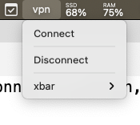

# xbar-cisco-vpn-plugin

Tired of entering password every time connecting to Cisco VPN, here is the one click connect solution, 
able to connect/disconnect in one click without entring password,  
the password is supplied from Mac keychain automatically.

## Prerequisite
1. Cisco VPN client

## Steps:
1. Create password in keychain

   `security add-generic-password -s SECRET_NAME  -a ACCOUNT_NAME -w 'VPN_PASSWORD'`

   https://blog.koehntopp.info/2017/01/26/command-line-access-to-the-mac-keychain.html

2. Install xbar
   https://github.com/matryer/xbar

3. Checkout this repo

4. Replace the following keys with actual values in **vpn.1d.sh**
   1. SYSTEM_USER_NAME

5. Replace the following keys with actual values in **vpn/start.sh**
   1. VPN_URL
   2. VPN_USERNAME
   3. SECRET_NAME
   4. ACCOUNT_NAME

6. Copy the files to ~/Library/Application Support/xbar/plugins/ directory
   1. plugins/vpn.1d.sh
   2. plugins/vpn/start.sh
   3. plugins/vpn/stop.sh

7. Restart/refresh the xbar

